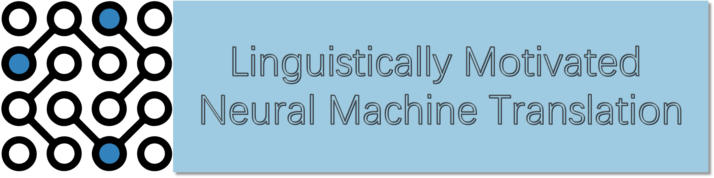

# Linguistically Motivated Neural Machine Translation
The official repo for the tutorial "**Linguistically Motivated Neural Machine Translation**" in The 25th Annual Conference of the European Association for Machine Translation (**EAMT 2024**).



## Introduction

This repository contains a comprehensive reading list for the tutorial on "Linguistically Motivated Neural Machine Translation." The tutorial focuses on incorporating linguistics into different stages of the neural machine translation (NMT) pipeline, from pre-processing to model training to evaluation.

## Presenters
| | |
|-|-|
|  | <a href="https://shyyhs.github.io/" style="color:#D42D50; text-decoration: underline;">**Haiyue Song**</a> is a technical researcher at the Advanced Translation Technology Laboratory, National Institute of Information and Communications Technology (NICT), Japan. He obtained his Ph.D. at Kyoto University. His research interests include machine translation, large language models, subword segmentation, and decoding algorithms. He has MT and LLMs related publications in TALLIP, AACL, LREC, ACL, and EMNLP. |
|  | <a href="https://scholar.google.com/citations?user=zJ0wGWoAAAAJ&hl=en" style="color:#D42D50; text-decoration: underline;">**Hour Kaing**</a> is a researcher at the Advanced Translation Technology Laboratory, National Institute of Information and Communications Technology (NICT), Japan. He received his B.S. from Institute of Technology of Cambodia, Cambodia, his M.Sc from University of Grenoble 1, France, and his Ph.D. from NARA Institute of Science and Technology, Japan. He is interested in linguistic analysis, low-resource machine translation, language modeling, and speech processing. He has publications in TALLIP, EACL, PACLIC, LREC, and IWSLT. |
|  | <a href="https://prajdabre.github.io/" style="color:#D42D50; text-decoration: underline;">**Raj Dabre**</a> is a senior researcher at the Advanced Translation Technology Laboratory, National Institute of Information and Communications Technology (NICT), Japan and an Adjunct Faculty at IIT Madras, India. He received his Ph.D. from Kyoto University and Masters from IIT Bombay. His primary interests are in low-resource NLP, language modeling and efficiency. He has published in ACL, EMNLP, NAACL, TMLR, AAAI, AACL, IJCNLP and CSUR. |

## Tutorial Overview

### Relevance to the MT Community

For machine translation (MT) tasks, purely data-driven approaches have been dominant in recent years, and language knowledge-related approaches are often neglected. This tutorial aims to highlight the importance of linguistic knowledge, especially for low-resource languages where training data is limited.

### Outline

1. **Introduction to Neural Machine Translation**
2. **Linguistically Motivated Tokenization and Transfer Learning**
3. **Augmenting NMT Architectures with Linguistic Features**
4. **Linguistically Aware Decoding**
5. **Linguistically Motivated Evaluation**
6. **Limitations and Future Directions**
7. **Summary and Conclusion**
8. **Discussion and Q/A**

### 📖 Reading List

#### 1. Introduction to Neural Machine Translation
1. [Neural Machine Translation: Basics, Practical Aspects and Recent Trends](https://aclanthology.org/I17-5004.pdf) - Dabre et al., 2017
2. [Attention is All you Need](https://proceedings.neurips.cc/paper_files/paper/2017/file/3f5ee243547dee91fbd053c1c4a845aa-Paper.pdf) - Vaswani et al., 2017
3. [Neural Machine Translation by Jointly Learning to Align and Translate](http://arxiv.org/abs/1409.0473) - Bahdanau et al., 2016


#### 2. Linguistically Motivated Tokenization and Transfer Learning
1. [Juman++: A Morphological Analysis Toolkit for Scriptio Continua](https://aclanthology.org/D18-2010) - Tolmachev et al., 2018
2. [Dynamic Programming Encoding for Subword Segmentation in Neural Machine Translation](https://aclanthology.org/2020.acl-main.275) - He et al., 2020
3. [BERTSeg: BERT Based Unsupervised Subword Segmentation for Neural Machine Translation](https://aclanthology.org/2022.aacl-short.12) - Song et al., 2022
4. [MorphyNet: a Large Multilingual Database of Derivational and Inflectional Morphology](https://aclanthology.org/2021.sigmorphon-1.5) - Batsuren et al., 2021
5. [Linguistically Motivated Vocabulary Reduction for Neural Machine Translation from Turkish to English](https://arxiv.org/abs/1707.09879) - Ataman et al., 2017
6. [Linguistically Motivated Subwords for English-Tamil Translation: University of Groningen’s Submission to WMT-2020](https://aclanthology.org/2020.wmt-1.9) - Dhar et al., 2020
7. [Neural Machine Translation of Logographic Languages Using Sub-character Level Information](https://aclanthology.org/W18-6303.pdf)
8. [On Romanization for Model Transfer Between Scripts in Neural Machine Translation](https://aclanthology.org/2020.findings-emnlp.223) - Amrhein and Sennrich, 2020
9. [RomanSetu: Efficiently unlocking multilingual capabilities of Large Language Models models via Romanization](https://arxiv.org/abs/2401.14280) - Husain et al., 2024
10. [CharSpan: Utilizing Lexical Similarity to Enable Zero-Shot Machine Translation for Extremely Low-resource Languages](https://arxiv.org/abs/2305.05214) - Maurya et al., 2024
11. [SelectNoise: Unsupervised Noise Injection to Enable Zero-Shot Machine Translation for Extremely Low-resource Languages](https://aclanthology.org/2023.findings-emnlp.109) - Brahma et al., 2023
12. [Pre-training via Leveraging Assisting Languages for Neural Machine Translation](https://aclanthology.org/2020.acl-srw.37) - Song et al., 2020
13. [IndicTrans2: Towards High-Quality and Accessible Machine Translation Models for all 22 Scheduled Indian Languages](https://openreview.net/forum?id=vfT4YuzAYA) - Gala et al., 2023
14. [IndicBART: A Pre-trained Model for Natural Language Generation of Indic Languages](https://arxiv.org/abs/2109.02903) - Dabre et al., 2021

#### 3. Augmenting NMT Architectures with Linguistic Features
1. [Linguistic Input Features Improve Neural Machine Translation](https://aclanthology.org/W16-2209) - Sennrich and Haddow, 2016
2. [FeatureBART: Feature Based Sequence-to-Sequence Pre-Training for Low-Resource NMT](https://aclanthology.org/2022.coling-1.443) - Chakrabarty et al., 2022
3. [Improving Low-Resource NMT through Relevance Based Linguistic Features Incorporation](https://aclanthology.org/2020.coling-main.376) - Chakrabarty et al., 2020
4. [Low-Resource Multilingual Neural Translation Using Linguistic Feature Based Relevance Mechanisms](https://doi.org/10.1145/3442382) - Chakrabarty et al., 2023
5. [Exploiting Linguistic Resources for Neural Machine Translation Using Multi-task Learning](https://aclanthology.org/W17-4708) - Niehues and Cho, 2017
6. [Syntax-Enhanced Neural Machine Translation with Syntax-Aware Word Representations](https://aclanthology.org/N19-1118) - Zhang et al., 2019
7. [Dependency-to-Dependency Neural Machine Translation](https://doi.org/10.1109/TASLP.2018.2855968) - Wu et al., 2018
8. [Multi-Source Syntactic Neural Machine Translation](https://aclanthology.org/D18-1327) - Currey and Heafield, 2018
9. [Incorporating Source Syntax into Transformer-Based Neural Machine Translation](https://aclanthology.org/W19-5203) - Currey and Heafield, 2019
10. [Enhancing Machine Translation with Dependency-Aware Self-Attention](https://aclanthology.org/2020.acl-main.147) - Bugliarello and Okazaki, 2020
11. [Passing Parser Uncertainty to the Transformer: Labeled Dependency Distributions for Neural Machine Translation](https://aclanthology.org/2022.eamt-1.7) - Pu and Sima'an, 2022
12. [Modeling Source Syntax for Neural Machine Translation](https://aclanthology.org/P17-1064) - Li et al., 2017

#### 4. Linguistically Aware Decoding
1. [Tree-to-Sequence Attentional Neural Machine Translation](https://aclanthology.org/P16-1078) - Eriguchi et al., 2016
2. [Improved Neural Machine Translation with a Syntax-Aware Encoder and Decoder](https://aclanthology.org/P17-1177) - Chen et al., 2017
3. [Learning to Parse and Translate Improves Neural Machine Translation](https://aclanthology.org/P17-2012) - Eriguchi et al., 2017
4. [Sequence-to-Dependency Neural Machine Translation](https://aclanthology.org/P17-1065) - Wu et al., 2017
5. [A Tree-based Decoder for Neural Machine Translation](https://aclanthology.org/D18-1509) - Wang et al., 2018
6. [Towards String-To-Tree Neural Machine Translation](https://aclanthology.org/P17-2021) - Aharoni and Goldberg, 2017
7. [Predicting Target Language CCG Supertags Improves Neural Machine Translation](https://aclanthology.org/W17-4708) - Nǎdejde et al., 2017
8. [Improving Neural Machine Translation with Soft Template Prediction](https://aclanthology.org/2020.acl-main.531) - Yang et al., 2020
9. [Explicit Syntactic Guidance for Neural Text Generation](https://aclanthology.org/2023.acl-long.788) - Li et al., 2023

#### 5. Linguistically Motivated Evaluation
1. [Linguistic Evaluation for the 2021 State-of-the-art Machine Translation Systems for German to English and English to German](https://aclanthology.org/2021.wmt-1.115) - Macketanz et al., 2021
2. [Linguistically Motivated Evaluation of Machine Translation Metrics Based on a Challenge Set](https://aclanthology.org/2022.wmt-1.45) - Avramidis and Macketanz, 2022
3. [Linguistically Motivated Evaluation of the 2023 State-of-the-art Machine Translation: Can ChatGPT Outperform NMT?](https://aclanthology.org/2023.wmt-1.23) - Manakhimova et al, 2023

## Authors

**Haiyue Song**, **Hour Kaing**, **Raj Dabre**  
National Institute of Information and Communications Technology (NICT)  
Hikaridai 3-5, Seika-cho, Soraku-gun, Kyoto, Japan  

**Emails:**  
- Haiyue Song: [haiyue.song@nict.go.jp](mailto:haiyue.song@nict.go.jp)  
- Hour Kaing: [hour_kaing@nict.go.jp](mailto:hour_kaing@nict.go.jp)  
- Raj Dabre: [raj.dabre@nict.go.jp](mailto:raj.dabre@nict.go.jp)

### Citation (bib)
```
@article{linguistic-mt24,
  title={Linguistically Motivated Neural Machine Translation},
  author={Song, Haiyue and Kaing, Hour and Dabre, Raj},
  booktitle={The 25th Annual Conference of the European Association for Machine Translation (EAMT 2024)},
  year={2024}
}